# ** Online Shop – Hackathon Phase 1 Submission **

# Online Shop Roadmap 🗺️

This document outlines the planned development roadmap for the Online Shop project, covering both feature implementations and technical improvements.

### DevOps

- [ ] Docker
  - Create a Dockerfile for the Application:
  - Apply Multi-stage to reduce images size:
  - Apply containerization concept using security best practices:
  - Push your image to DockerHub:

### **Create a Dockerfile for the Application and testing it**

- Created an Dockerfile for `online_shop` project.

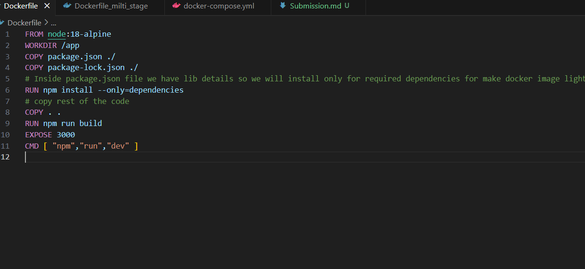

- lets build and test the `Dockerfile` weather it is working fine or not

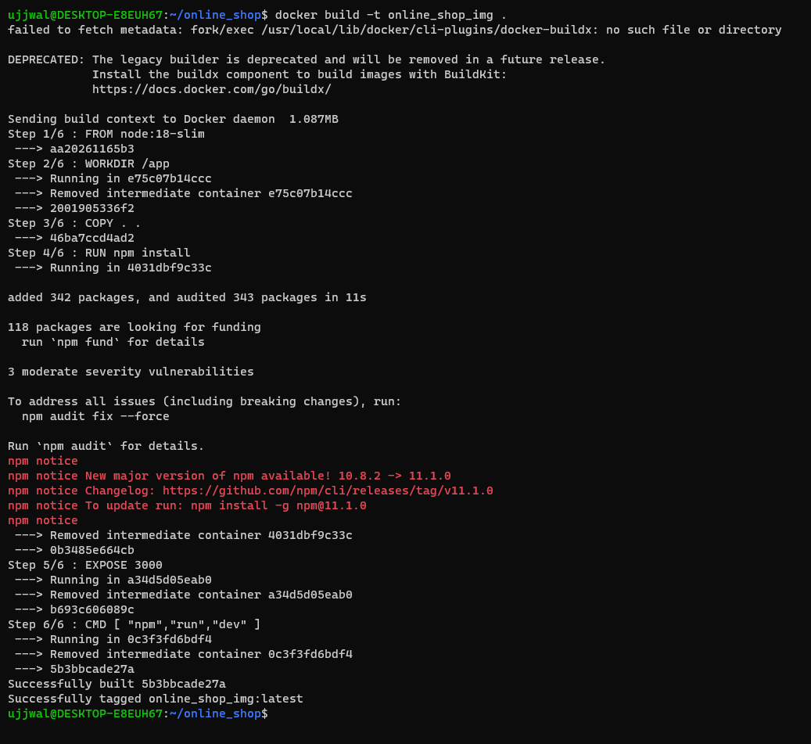

- upon successfull image build I have created an container using `docker run -d -p 3000:3000 --name online_shop online_shop_img`

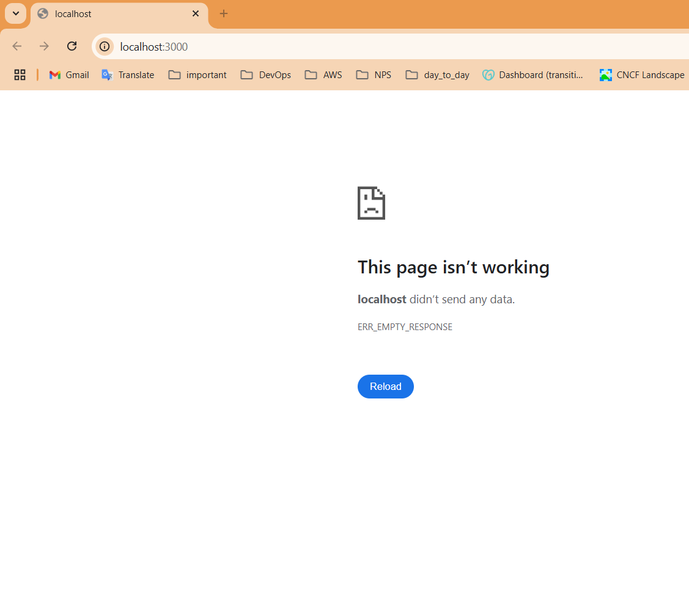

- lets check the logs for dead container.

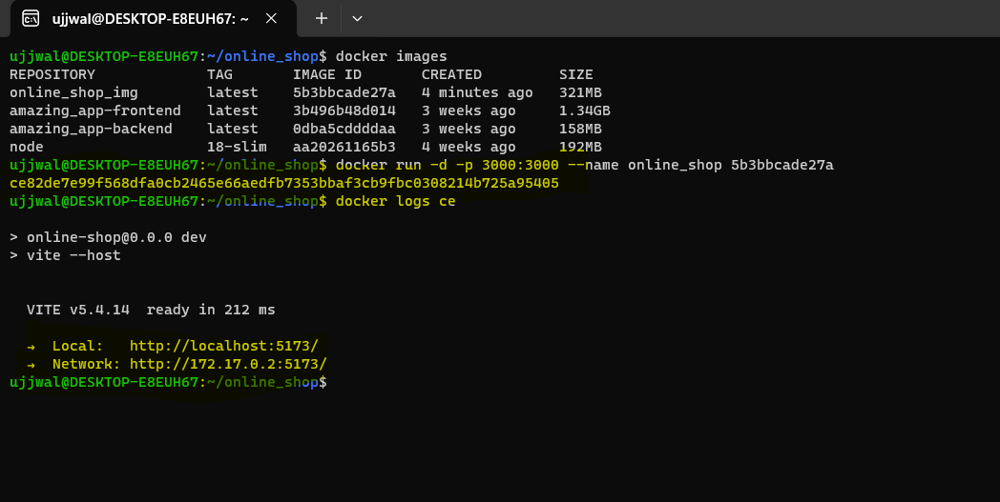

- lets rerun the container with port mapping 5173 instead of 3000 just for testing purpose latter I will map to 3000.

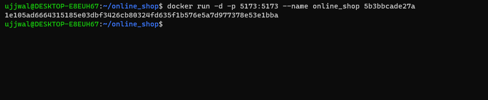

- Checking the http://localhost:5173

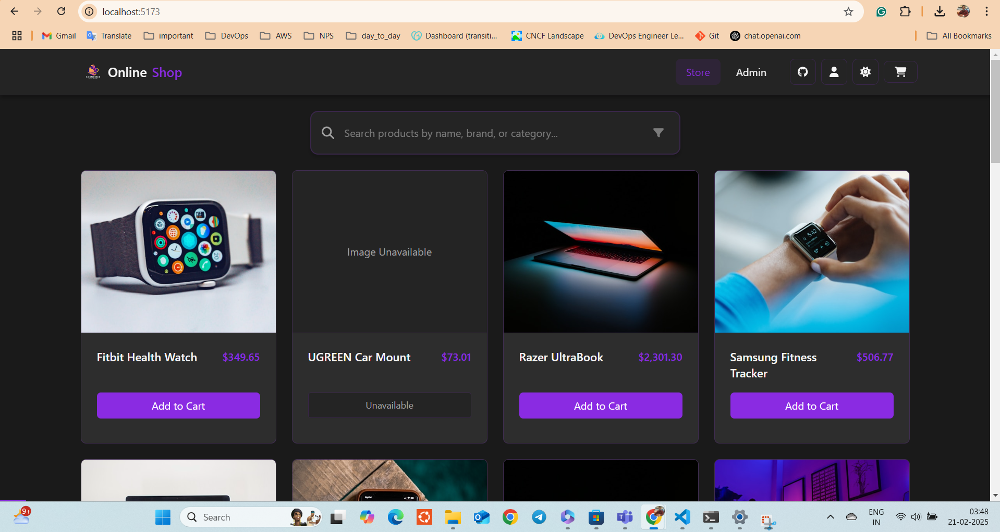

### ** Apply Multi-stage to reduce images size **

- Lets create an Multi-stage file to reduce image size.
  - here is the dockerfile for Multi-stage.

  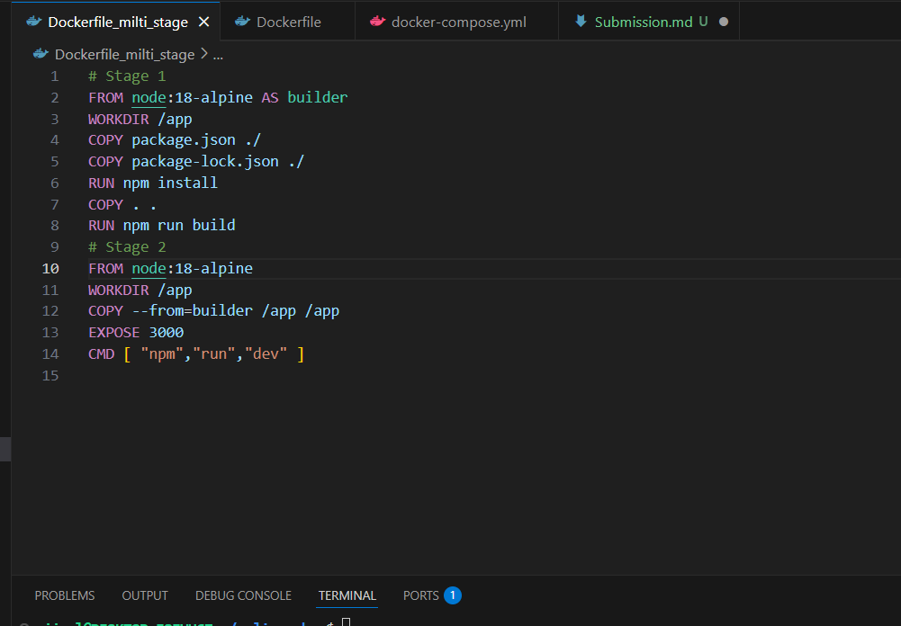

- Lets try to build the multi-stage docker file and see the size difference.
  - To build the multi-stage file I used this command `docker build -t online_shop_multi_stage -f Dockerfile_multi_stage`

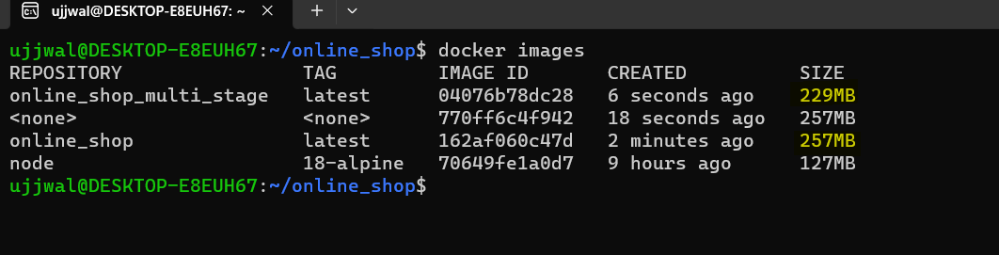

- I have implemented docker-compose file also to automate to create docker image and run the container.
  - here is the code.
  
    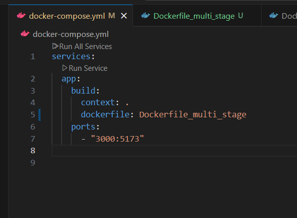

- Here the in the docker compose file I'm pointing to Docker_multi_stage Dockerfile so that image will be of less size.
  - To run the Docker-compose I user this command `docker-compose up -d`

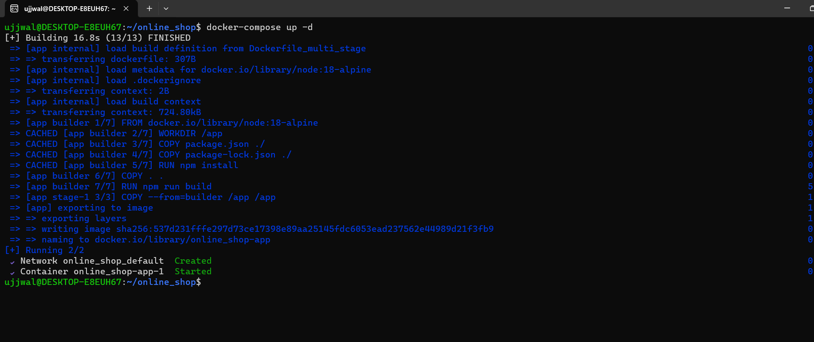

- Let go to chrome and check http://localhost:3000

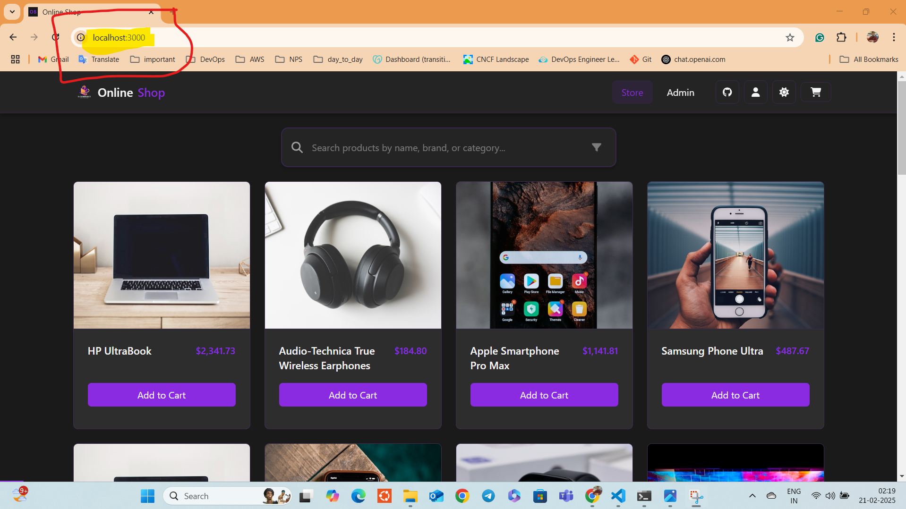

- Here you can see that the application in running on port `3000` only not at `5173`

- Lets terminate the runing container user docker-compose command 
  - Used command is docker-compose down

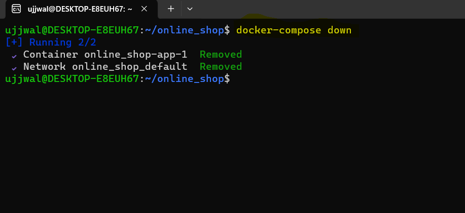

### **Push your image to DockerHub**

- To push the image to DockerHub I have followed below steps.
  1. Login into dockerhub using `docker login`
  2. Give you credentials like `username` and `password`.
  3. Tag the image which you want to push to dockerhub.
     `docker tag online_shop:latest ujkumar11/devops_online_shop:latest`

     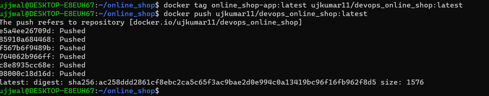
     
  4. Lets check the Docker Hub account for last image pushed

      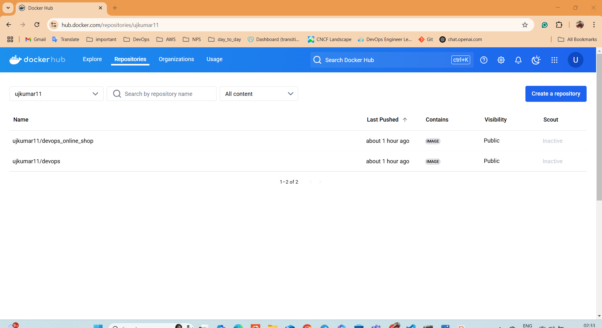
  
  5. To pull the image you need to run this command `docker pull ujkumar11/devops_online_shop:latest`

